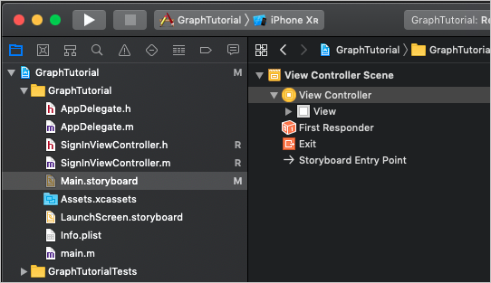
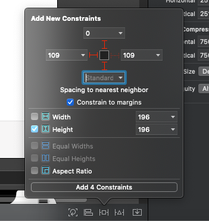
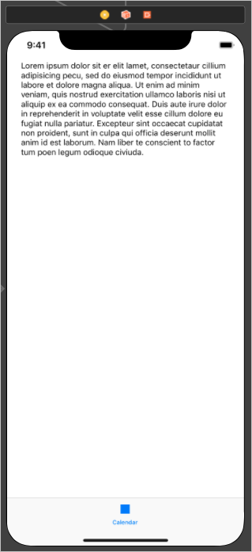
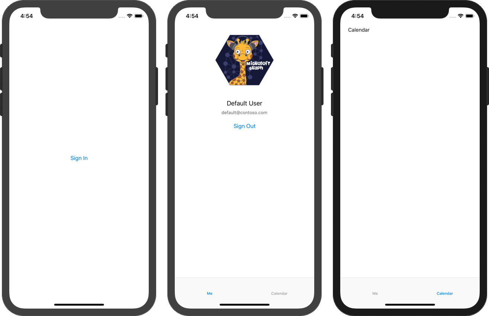

<!-- markdownlint-disable MD002 MD041 -->

<span data-ttu-id="2fda6-101">首先创建一个新的 Swift 项目。</span><span class="sxs-lookup"><span data-stu-id="2fda6-101">Begin by creating a new Swift project.</span></span>

1. <span data-ttu-id="2fda6-102">打开 Xcode。</span><span class="sxs-lookup"><span data-stu-id="2fda6-102">Open Xcode.</span></span> <span data-ttu-id="2fda6-103">在 "**文件**" 菜单上，依次选择 "**新建**"、"**项目**"。</span><span class="sxs-lookup"><span data-stu-id="2fda6-103">On the **File** menu, select **New**, then **Project**.</span></span>
1. <span data-ttu-id="2fda6-104">选择 "**单个视图应用程序**" 模板，然后选择 "**下一步**"。</span><span class="sxs-lookup"><span data-stu-id="2fda6-104">Choose the **Single View App** template and select **Next**.</span></span>

    

1. <span data-ttu-id="2fda6-106">将 "**产品名称**" `GraphTutorial`和 "**语言**" 设置为 "**目标-C**"。</span><span class="sxs-lookup"><span data-stu-id="2fda6-106">Set the **Product Name** to `GraphTutorial` and the **Language** to **Objective-C**.</span></span>
1. <span data-ttu-id="2fda6-107">填写其余字段，然后选择 "**下一步**"。</span><span class="sxs-lookup"><span data-stu-id="2fda6-107">Fill in the remaining fields and select **Next**.</span></span>
1. <span data-ttu-id="2fda6-108">选择项目的位置并选择 "**创建**"。</span><span class="sxs-lookup"><span data-stu-id="2fda6-108">Choose a location for the project and select **Create**.</span></span>

## <a name="install-dependencies"></a><span data-ttu-id="2fda6-109">安装依赖项</span><span class="sxs-lookup"><span data-stu-id="2fda6-109">Install dependencies</span></span>

<span data-ttu-id="2fda6-110">在继续之前，请安装稍后将使用的一些其他依赖项。</span><span class="sxs-lookup"><span data-stu-id="2fda6-110">Before moving on, install some additional dependencies that you will use later.</span></span>

- <span data-ttu-id="2fda6-111">适用于[iOS 的 Microsoft 身份验证库（MSAL）](https://github.com/AzureAD/microsoft-authentication-library-for-objc) ，用于向 Azure AD 进行身份验证。</span><span class="sxs-lookup"><span data-stu-id="2fda6-111">[Microsoft Authentication Library (MSAL) for iOS](https://github.com/AzureAD/microsoft-authentication-library-for-objc) for authenticating to with Azure AD.</span></span>
- <span data-ttu-id="2fda6-112">[Microsoft GRAPH SDK For 客观 C](https://github.com/microsoftgraph/msgraph-sdk-objc) ，用于调用 Microsoft graph。</span><span class="sxs-lookup"><span data-stu-id="2fda6-112">[Microsoft Graph SDK for Objective C](https://github.com/microsoftgraph/msgraph-sdk-objc) for making calls to Microsoft Graph.</span></span>
- <span data-ttu-id="2fda6-113">[Microsoft Graph 模型 SDK （针对目标 C](https://github.com/microsoftgraph/msgraph-sdk-objc-models) ）对于强类型的对象，表示 Microsoft Graph 资源，如用户或事件。</span><span class="sxs-lookup"><span data-stu-id="2fda6-113">[Microsoft Graph Models SDK for Objective C](https://github.com/microsoftgraph/msgraph-sdk-objc-models) for strongly-typed objects representing Microsoft Graph resources like users or events.</span></span>

1. <span data-ttu-id="2fda6-114">退出 Xcode。</span><span class="sxs-lookup"><span data-stu-id="2fda6-114">Quit Xcode.</span></span>
1. <span data-ttu-id="2fda6-115">打开 "终端" 并将目录更改为**GraphTutorial**项目的位置。</span><span class="sxs-lookup"><span data-stu-id="2fda6-115">Open Terminal and change the directory to the location of your **GraphTutorial** project.</span></span>
1. <span data-ttu-id="2fda6-116">运行以下命令以创建 Podfile。</span><span class="sxs-lookup"><span data-stu-id="2fda6-116">Run the following command to create a Podfile.</span></span>

    ```Shell
    pod init
    ```

1. <span data-ttu-id="2fda6-117">打开 Podfile，并在行的`use_frameworks!`后面添加以下行。</span><span class="sxs-lookup"><span data-stu-id="2fda6-117">Open the Podfile and add the following lines just after the `use_frameworks!` line.</span></span>

    ```Ruby
    pod 'MSAL', '~> 1.1.1'
    pod 'MSGraphClientSDK', ' ~> 1.0.0'
    pod 'MSGraphClientModels', '~> 1.3.0'
    ```

1. <span data-ttu-id="2fda6-118">保存 Podfile，然后运行以下命令来安装依赖项。</span><span class="sxs-lookup"><span data-stu-id="2fda6-118">Save the Podfile, then run the following command to install the dependencies.</span></span>

    ```Shell
    pod install
    ```

1. <span data-ttu-id="2fda6-119">命令完成后，在 Xcode 中打开新创建的**GraphTutorial graph-ios-swift-connect.xcworkspace** 。</span><span class="sxs-lookup"><span data-stu-id="2fda6-119">Once the command completes, open the newly created **GraphTutorial.xcworkspace** in Xcode.</span></span>

## <a name="design-the-app"></a><span data-ttu-id="2fda6-120">设计应用程序</span><span class="sxs-lookup"><span data-stu-id="2fda6-120">Design the app</span></span>

<span data-ttu-id="2fda6-121">在本节中，您将为应用程序创建视图：登录页面、选项卡栏导航器、欢迎页面和日历页面。</span><span class="sxs-lookup"><span data-stu-id="2fda6-121">In this section you will create the views for the app: a sign in page, a tab bar navigator, a welcome page, and a calendar page.</span></span> <span data-ttu-id="2fda6-122">您还将创建活动指示器覆盖。</span><span class="sxs-lookup"><span data-stu-id="2fda6-122">You'll also create an activity indicator overlay.</span></span>

### <a name="create-sign-in-page"></a><span data-ttu-id="2fda6-123">创建登录页</span><span class="sxs-lookup"><span data-stu-id="2fda6-123">Create sign in page</span></span>

1. <span data-ttu-id="2fda6-124">展开 Xcode 中的 " **GraphTutorial** " 文件夹，然后选择**viewcontroller.m**文件。</span><span class="sxs-lookup"><span data-stu-id="2fda6-124">Expand the **GraphTutorial** folder in Xcode, then select the **ViewController.m** file.</span></span>
1. <span data-ttu-id="2fda6-125">在**文件检查器**中，将文件的**名称**更改为`SignInViewController.m`。</span><span class="sxs-lookup"><span data-stu-id="2fda6-125">In the **File Inspector**, change the **Name** of the file to `SignInViewController.m`.</span></span>

    

1. <span data-ttu-id="2fda6-127">打开**SignInViewController**并将其内容替换为以下代码。</span><span class="sxs-lookup"><span data-stu-id="2fda6-127">Open **SignInViewController.m** and replace its contents with the following code.</span></span>

    ```objc
    #import "SignInViewController.h"

    @interface SignInViewController ()

    @end

    @implementation SignInViewController

    - (void)viewDidLoad {
        [super viewDidLoad];
        // Do any additional setup after loading the view.
    }

    - (IBAction)signIn {
        [self performSegueWithIdentifier: @"userSignedIn" sender: nil];
    }
    @end
    ```

1. <span data-ttu-id="2fda6-128">选择 " **viewcontroller.m** " 文件。</span><span class="sxs-lookup"><span data-stu-id="2fda6-128">Select the **ViewController.h** file.</span></span>
1. <span data-ttu-id="2fda6-129">在**文件检查器**中，将文件的**名称**更改为`SignInViewController.h`。</span><span class="sxs-lookup"><span data-stu-id="2fda6-129">In the **File Inspector**, change the **Name** of the file to `SignInViewController.h`.</span></span>
1. <span data-ttu-id="2fda6-130">打开**SignInViewController** ，并将的`ViewController`所有实例更改为`SignInViewController`。</span><span class="sxs-lookup"><span data-stu-id="2fda6-130">Open **SignInViewController.h** and change all instances of `ViewController` to `SignInViewController`.</span></span>

1. <span data-ttu-id="2fda6-131">打开 " **storyboard** " 文件。</span><span class="sxs-lookup"><span data-stu-id="2fda6-131">Open the **Main.storyboard** file.</span></span>
1. <span data-ttu-id="2fda6-132">展开 "**查看控制器场景**"，然后选择 "**查看控制器**"。</span><span class="sxs-lookup"><span data-stu-id="2fda6-132">Expand **View Controller Scene**, then select **View Controller**.</span></span>

    

1. <span data-ttu-id="2fda6-134">选择 "**标识" 检查器**，然后将 "**类**" 下拉列表更改为 " **SignInViewController**"。</span><span class="sxs-lookup"><span data-stu-id="2fda6-134">Select the **Identity Inspector**, then change the **Class** dropdown to **SignInViewController**.</span></span>

    

1. <span data-ttu-id="2fda6-136">选择**库**，然后将**按钮**拖到 "**登录视图" 控制器**上。</span><span class="sxs-lookup"><span data-stu-id="2fda6-136">Select the **Library**, then drag a **Button** onto the **Sign In View Controller**.</span></span>

    

1. <span data-ttu-id="2fda6-138">选择该按钮后，选择 "**属性" 检查器**， **Title**并将按钮的标题`Sign In`更改为。</span><span class="sxs-lookup"><span data-stu-id="2fda6-138">With the button selected, select the **Attributes Inspector** and change the **Title** of the button to `Sign In`.</span></span>

    

1. <span data-ttu-id="2fda6-140">选择该按钮后，选择情节提要底部的 "**对齐**" 按钮。</span><span class="sxs-lookup"><span data-stu-id="2fda6-140">With the button selected, select the **Align** button at the bottom of the storyboard.</span></span> <span data-ttu-id="2fda6-141">同时选择 "**容器中的水平**" 和 "**在容器**约束中垂直"，将它们的值保留为0，然后选择 "**添加2个约束**"。</span><span class="sxs-lookup"><span data-stu-id="2fda6-141">Select both the **Horizontally in container** and **Vertically in container** constraints, leave their values as 0, then select **Add 2 constraints**.</span></span>

    

1. <span data-ttu-id="2fda6-143">选择 "**登录视图控制器**"，然后选择 "**连接检查器**"。</span><span class="sxs-lookup"><span data-stu-id="2fda6-143">Select the **Sign In View Controller**, then select the **Connections Inspector**.</span></span>
1. <span data-ttu-id="2fda6-144">在 "**接收的操作**" 下，将 "**登录**" 旁边的未填充圆圈拖到按钮上。</span><span class="sxs-lookup"><span data-stu-id="2fda6-144">Under **Received Actions**, drag the unfilled circle next to **signIn** onto the button.</span></span> <span data-ttu-id="2fda6-145">在弹出菜单上选择 "**向上触摸**"。</span><span class="sxs-lookup"><span data-stu-id="2fda6-145">Select **Touch Up Inside** on the pop-up menu.</span></span>

    

### <a name="create-tab-bar"></a><span data-ttu-id="2fda6-147">创建选项卡栏</span><span class="sxs-lookup"><span data-stu-id="2fda6-147">Create tab bar</span></span>

1. <span data-ttu-id="2fda6-148">选择**库**，然后将**选项卡栏控制器**拖到情节提要上。</span><span class="sxs-lookup"><span data-stu-id="2fda6-148">Select the **Library**, then drag a **Tab Bar Controller** onto the storyboard.</span></span>
1. <span data-ttu-id="2fda6-149">选择 "**登录视图控制器**"，然后选择 "**连接检查器**"。</span><span class="sxs-lookup"><span data-stu-id="2fda6-149">Select the **Sign In View Controller**, then select the **Connections Inspector**.</span></span>
1. <span data-ttu-id="2fda6-150">在 "已**触发 Segues**" 下，将 "**手动**" 旁边的未填充圆圈拖到情节提要上的**选项卡栏控制器**上。</span><span class="sxs-lookup"><span data-stu-id="2fda6-150">Under **Triggered Segues**, drag the unfilled circle next to **manual** onto the **Tab Bar Controller** on the storyboard.</span></span> <span data-ttu-id="2fda6-151">在弹出菜单中选择 "**模式显示**"。</span><span class="sxs-lookup"><span data-stu-id="2fda6-151">Select **Present Modally** in the pop-up menu.</span></span>

    

1. <span data-ttu-id="2fda6-153">选择您刚刚添加的 segue，然后选择 "**属性" 检查器**。</span><span class="sxs-lookup"><span data-stu-id="2fda6-153">Select the segue you just added, then select the **Attributes Inspector**.</span></span> <span data-ttu-id="2fda6-154">将 "**标识符**" 字段`userSignedIn`**设置为，** 并将 "**演示文稿**" 设置为全屏。</span><span class="sxs-lookup"><span data-stu-id="2fda6-154">Set the **Identifier** field to `userSignedIn`, and set **Presentation** to **Full Screen**.</span></span>

    

1. <span data-ttu-id="2fda6-156">选择 "**项目1场景**"，然后选择 "**连接检查器**"。</span><span class="sxs-lookup"><span data-stu-id="2fda6-156">Select the **Item 1 Scene**, then select the **Connections Inspector**.</span></span>
1. <span data-ttu-id="2fda6-157">在 "已**触发 Segues**" 下，将 "**手动**" 旁边的未填充圆圈拖到情节提要上的 "**登录视图控制器" 中**。</span><span class="sxs-lookup"><span data-stu-id="2fda6-157">Under **Triggered Segues**, drag the unfilled circle next to **manual** onto the **Sign In View Controller** on the storyboard.</span></span> <span data-ttu-id="2fda6-158">在弹出菜单中选择 "**模式显示**"。</span><span class="sxs-lookup"><span data-stu-id="2fda6-158">Select **Present Modally** in the pop-up menu.</span></span>
1. <span data-ttu-id="2fda6-159">选择您刚刚添加的 segue，然后选择 "**属性" 检查器**。</span><span class="sxs-lookup"><span data-stu-id="2fda6-159">Select the segue you just added, then select the **Attributes Inspector**.</span></span> <span data-ttu-id="2fda6-160">将 "**标识符**" 字段`userSignedOut`**设置为，** 并将 "**演示文稿**" 设置为全屏。</span><span class="sxs-lookup"><span data-stu-id="2fda6-160">Set the **Identifier** field to `userSignedOut`, and set **Presentation** to **Full Screen**.</span></span>

### <a name="create-welcome-page"></a><span data-ttu-id="2fda6-161">创建欢迎页面</span><span class="sxs-lookup"><span data-stu-id="2fda6-161">Create welcome page</span></span>

1. <span data-ttu-id="2fda6-162">选择 " **xcassets** " 文件。</span><span class="sxs-lookup"><span data-stu-id="2fda6-162">Select the **Assets.xcassets** file.</span></span>
1. <span data-ttu-id="2fda6-163">在**编辑器**菜单上，选择 "**添加资源**"，然后选择 "**新建图像集**"。</span><span class="sxs-lookup"><span data-stu-id="2fda6-163">On the **Editor** menu, select **Add Assets**, then **New Image Set**.</span></span>
1. <span data-ttu-id="2fda6-164">选择新**图像**资产，并使用 "**属性" 检查器**将其**名称**设置为`DefaultUserPhoto`。</span><span class="sxs-lookup"><span data-stu-id="2fda6-164">Select the new **Image** asset and use the **Attribute Inspector** to set its **Name** to `DefaultUserPhoto`.</span></span>
1. <span data-ttu-id="2fda6-165">添加您希望用作默认用户配置文件照片的任何图像。</span><span class="sxs-lookup"><span data-stu-id="2fda6-165">Add any image you like to serve as a default user profile photo.</span></span>

    

1. <span data-ttu-id="2fda6-167">在名为`WelcomeViewController`的**GraphTutorial**文件夹中创建一个新的**Cocoa Touch 类**文件。</span><span class="sxs-lookup"><span data-stu-id="2fda6-167">Create a new **Cocoa Touch Class** file in the **GraphTutorial** folder named `WelcomeViewController`.</span></span> <span data-ttu-id="2fda6-168">在字段的 "**子类**" 中选择 " **UIViewController** "。</span><span class="sxs-lookup"><span data-stu-id="2fda6-168">Choose **UIViewController** in the **Subclass of** field.</span></span>
1. <span data-ttu-id="2fda6-169">打开**WelcomeViewController** ，并将以下代码添加到`@interface`声明中。</span><span class="sxs-lookup"><span data-stu-id="2fda6-169">Open **WelcomeViewController.h** and add the following code inside the `@interface` declaration.</span></span>

    ```objc
    @property (nonatomic) IBOutlet UIImageView *userProfilePhoto;
    @property (nonatomic) IBOutlet UILabel *userDisplayName;
    @property (nonatomic) IBOutlet UILabel *userEmail;
    ```

1. <span data-ttu-id="2fda6-170">打开**WelcomeViewController**并将其内容替换为以下代码。</span><span class="sxs-lookup"><span data-stu-id="2fda6-170">Open **WelcomeViewController.m** and replace its contents with the following code.</span></span>

    ```objc
    #import "WelcomeViewController.h"

    @interface WelcomeViewController ()

    @end

    @implementation WelcomeViewController

    - (void)viewDidLoad {
        [super viewDidLoad];
        // Do any additional setup after loading the view.

        // TEMPORARY
        self.userProfilePhoto.image = [UIImage imageNamed:@"DefaultUserPhoto"];
        self.userDisplayName.text = @"Default User";
        [self.userDisplayName sizeToFit];
        self.userEmail.text = @"default@contoso.com";
        [self.userEmail sizeToFit];
    }

    - (IBAction)signOut {
        [self performSegueWithIdentifier: @"userSignedOut" sender: nil];
    }

    @end
    ```

1. <span data-ttu-id="2fda6-171">打开 "**情节提要**"。</span><span class="sxs-lookup"><span data-stu-id="2fda6-171">Open **Main.storyboard**.</span></span> <span data-ttu-id="2fda6-172">选择 "**项目1场景**"，然后选择 "**标识检查器**"。</span><span class="sxs-lookup"><span data-stu-id="2fda6-172">Select the **Item 1 Scene**, then select the **Identity Inspector**.</span></span> <span data-ttu-id="2fda6-173">将 "**类**" 值更改为**WelcomeViewController**。</span><span class="sxs-lookup"><span data-stu-id="2fda6-173">Change the **Class** value to **WelcomeViewController**.</span></span>
1. <span data-ttu-id="2fda6-174">使用**库**将以下项添加到**Item 1 场景**中。</span><span class="sxs-lookup"><span data-stu-id="2fda6-174">Using the **Library**, add the following items to the **Item 1 Scene**.</span></span>

    - <span data-ttu-id="2fda6-175">一个**图像视图**</span><span class="sxs-lookup"><span data-stu-id="2fda6-175">One **Image View**</span></span>
    - <span data-ttu-id="2fda6-176">两个**标签**</span><span class="sxs-lookup"><span data-stu-id="2fda6-176">Two **Labels**</span></span>
    - <span data-ttu-id="2fda6-177">一个**按钮**</span><span class="sxs-lookup"><span data-stu-id="2fda6-177">One **Button**</span></span>

1. <span data-ttu-id="2fda6-178">使用 "**连接检查器**" 进行以下连接。</span><span class="sxs-lookup"><span data-stu-id="2fda6-178">Using the **Connections Inspector**, make the following connections.</span></span>

    - <span data-ttu-id="2fda6-179">将**userDisplayName**插座链接到第一个标签。</span><span class="sxs-lookup"><span data-stu-id="2fda6-179">Link the **userDisplayName** outlet to the first label.</span></span>
    - <span data-ttu-id="2fda6-180">将**userEmail**插座链接到第二个标签。</span><span class="sxs-lookup"><span data-stu-id="2fda6-180">Link the **userEmail** outlet to the second label.</span></span>
    - <span data-ttu-id="2fda6-181">将**userProfilePhoto**插座链接到图像视图。</span><span class="sxs-lookup"><span data-stu-id="2fda6-181">Link the **userProfilePhoto** outlet to the image view.</span></span>
    - <span data-ttu-id="2fda6-182">将**signOut**接收的操作链接到按钮的**内部**。</span><span class="sxs-lookup"><span data-stu-id="2fda6-182">Link the **signOut** received action to the button's **Touch Up Inside**.</span></span>

1. <span data-ttu-id="2fda6-183">选择 "图像" 视图，然后选择 "**大小" 检查器**。</span><span class="sxs-lookup"><span data-stu-id="2fda6-183">Select the image view, then select the **Size Inspector**.</span></span>
1. <span data-ttu-id="2fda6-184">将 "**宽度**" 和 "**高度**" 设置为196。</span><span class="sxs-lookup"><span data-stu-id="2fda6-184">Set the **Width** and **Height** to 196.</span></span>
1. <span data-ttu-id="2fda6-185">使用 "**对齐**" 按钮**在容器约束中**添加值为0的水平。</span><span class="sxs-lookup"><span data-stu-id="2fda6-185">Use the **Align** button to add the **Horizontally in container** constraint with a value of 0.</span></span>
1. <span data-ttu-id="2fda6-186">使用 "**添加新约束**" 按钮（在 "**对齐**" 按钮旁边）添加以下约束：</span><span class="sxs-lookup"><span data-stu-id="2fda6-186">Use the **Add New Constraints** button (next to the **Align** button) to add the following constraints:</span></span>

    - <span data-ttu-id="2fda6-187">顶端对齐：安全区域，值：0</span><span class="sxs-lookup"><span data-stu-id="2fda6-187">Align Top to: Safe Area, value: 0</span></span>
    - <span data-ttu-id="2fda6-188">底部空间：用户显示名称、值：标准</span><span class="sxs-lookup"><span data-stu-id="2fda6-188">Bottom Space to: User Display Name, value: Standard</span></span>
    - <span data-ttu-id="2fda6-189">Height，value：196</span><span class="sxs-lookup"><span data-stu-id="2fda6-189">Height, value: 196</span></span>
    - <span data-ttu-id="2fda6-190">Width，value：196</span><span class="sxs-lookup"><span data-stu-id="2fda6-190">Width, value: 196</span></span>

    

1. <span data-ttu-id="2fda6-192">选择第一个标签，然后使用 "**对齐**" 按钮**在容器约束中**添加值为0的水平。</span><span class="sxs-lookup"><span data-stu-id="2fda6-192">Select the first label, then use the **Align** button to add the **Horizontally in container** constraint with a value of 0.</span></span>
1. <span data-ttu-id="2fda6-193">使用 "**添加新约束**" 按钮添加以下约束：</span><span class="sxs-lookup"><span data-stu-id="2fda6-193">Use the **Add New Constraints** button to add the following constraints:</span></span>

    - <span data-ttu-id="2fda6-194">顶部空间：用户个人资料照片，值：标准</span><span class="sxs-lookup"><span data-stu-id="2fda6-194">Top Space to: User Profile Photo, value: Standard</span></span>
    - <span data-ttu-id="2fda6-195">底部空间：用户电子邮件，值：标准</span><span class="sxs-lookup"><span data-stu-id="2fda6-195">Bottom Space to: User Email, value: Standard</span></span>

1. <span data-ttu-id="2fda6-196">选择第二个标签，然后选择 "**属性" 检查器**。</span><span class="sxs-lookup"><span data-stu-id="2fda6-196">Select the second label, then select the **Attributes Inspector**.</span></span>
1. <span data-ttu-id="2fda6-197">将**颜色**更改为**深灰色**的颜色，并将**字体**更改为**系统 12.0**。</span><span class="sxs-lookup"><span data-stu-id="2fda6-197">Change the **Color** to **Dark Gray Color**, and change the **Font** to **System 12.0**.</span></span>
1. <span data-ttu-id="2fda6-198">使用 "**对齐**" 按钮**在容器约束中**添加值为0的水平。</span><span class="sxs-lookup"><span data-stu-id="2fda6-198">Use the **Align** button to add the **Horizontally in container** constraint with a value of 0.</span></span>
1. <span data-ttu-id="2fda6-199">使用 "**添加新约束**" 按钮添加以下约束：</span><span class="sxs-lookup"><span data-stu-id="2fda6-199">Use the **Add New Constraints** button to add the following constraints:</span></span>

    - <span data-ttu-id="2fda6-200">顶部间距：用户显示名称、值：标准</span><span class="sxs-lookup"><span data-stu-id="2fda6-200">Top Space to: User Display Name, value: Standard</span></span>
    - <span data-ttu-id="2fda6-201">底部空间：注销，值：14</span><span class="sxs-lookup"><span data-stu-id="2fda6-201">Bottom Space to: Sign Out, value: 14</span></span>

1. <span data-ttu-id="2fda6-202">选择该按钮，然后选择 "**属性" 检查器**。</span><span class="sxs-lookup"><span data-stu-id="2fda6-202">Select the button, then select the **Attributes Inspector**.</span></span>
1. <span data-ttu-id="2fda6-203">将 "**标题**" `Sign Out`更改为。</span><span class="sxs-lookup"><span data-stu-id="2fda6-203">Change the **Title** to `Sign Out`.</span></span>
1. <span data-ttu-id="2fda6-204">使用 "**对齐**" 按钮**在容器约束中**添加值为0的水平。</span><span class="sxs-lookup"><span data-stu-id="2fda6-204">Use the **Align** button to add the **Horizontally in container** constraint with a value of 0.</span></span>
1. <span data-ttu-id="2fda6-205">使用 "**添加新约束**" 按钮添加以下约束：</span><span class="sxs-lookup"><span data-stu-id="2fda6-205">Use the **Add New Constraints** button to add the following constraints:</span></span>

    - <span data-ttu-id="2fda6-206">主要空间：用户电子邮件，值：14</span><span class="sxs-lookup"><span data-stu-id="2fda6-206">Top Space to: User Email, value: 14</span></span>

1. <span data-ttu-id="2fda6-207">选择场景底部的 "选项卡栏" 项，然后选择 "**属性" 检查器**。</span><span class="sxs-lookup"><span data-stu-id="2fda6-207">Select the tab bar item at the bottom of the scene, then select the **Attributes Inspector**.</span></span> <span data-ttu-id="2fda6-208">将 "**标题**" `Me`更改为。</span><span class="sxs-lookup"><span data-stu-id="2fda6-208">Change the **Title** to `Me`.</span></span>
1. <span data-ttu-id="2fda6-209">在**编辑器**菜单上，选择 "**解决自动布局问题**"，然后选择 **"欢迎视图控制器中的所有视图"** 下的 "**添加缺少约束**"。</span><span class="sxs-lookup"><span data-stu-id="2fda6-209">On the **Editor** menu, select **Resolve Auto Layout Issues**, then select **Add Missing Constraints** underneath **All Views in Welcome View Controller**.</span></span>

<span data-ttu-id="2fda6-210">完成后，欢迎场景应如下所示。</span><span class="sxs-lookup"><span data-stu-id="2fda6-210">The welcome scene should look similar to this once you're done.</span></span>


### <a name="create-calendar-page"></a><span data-ttu-id="2fda6-212">创建日历页</span><span class="sxs-lookup"><span data-stu-id="2fda6-212">Create calendar page</span></span>

1. <span data-ttu-id="2fda6-213">在名为`CalendarViewController`的**GraphTutorial**文件夹中创建一个新的**Cocoa Touch 类**文件。</span><span class="sxs-lookup"><span data-stu-id="2fda6-213">Create a new **Cocoa Touch Class** file in the **GraphTutorial** folder named `CalendarViewController`.</span></span> <span data-ttu-id="2fda6-214">在字段的 "**子类**" 中选择 " **UIViewController** "。</span><span class="sxs-lookup"><span data-stu-id="2fda6-214">Choose **UIViewController** in the **Subclass of** field.</span></span>
1. <span data-ttu-id="2fda6-215">打开**CalendarViewController** ，并将以下代码添加到`@interface`声明中。</span><span class="sxs-lookup"><span data-stu-id="2fda6-215">Open **CalendarViewController.h** and add the following code inside the `@interface` declaration.</span></span>

    ```objc
    @property (nonatomic) IBOutlet UITextView *calendarJSON;
    ```

1. <span data-ttu-id="2fda6-216">打开**CalendarViewController**并将其内容替换为以下代码。</span><span class="sxs-lookup"><span data-stu-id="2fda6-216">Open **CalendarViewController.m** and replace its contents with the following code.</span></span>

    ```objc
    #import "CalendarViewController.h"

    @interface CalendarViewController ()

    @end

    @implementation CalendarViewController

    - (void)viewDidLoad {
        [super viewDidLoad];
        // Do any additional setup after loading the view.

        // TEMPORARY
        self.calendarJSON.text = @"Calendar";
        [self.calendarJSON sizeToFit];
    }

    @end
    ```

1. <span data-ttu-id="2fda6-217">打开 "**情节提要**"。</span><span class="sxs-lookup"><span data-stu-id="2fda6-217">Open **Main.storyboard**.</span></span> <span data-ttu-id="2fda6-218">选择 "**项目2场景**"，然后选择 "**标识检查器**"。</span><span class="sxs-lookup"><span data-stu-id="2fda6-218">Select the **Item 2 Scene**, then select the **Identity Inspector**.</span></span> <span data-ttu-id="2fda6-219">将 "**类**" 值更改为**CalendarViewController**。</span><span class="sxs-lookup"><span data-stu-id="2fda6-219">Change the **Class** value to **CalendarViewController**.</span></span>
1. <span data-ttu-id="2fda6-220">使用**库**向**项目2场景**添加**文本视图**。</span><span class="sxs-lookup"><span data-stu-id="2fda6-220">Using the **Library**, add a **Text View** to the **Item 2 Scene**.</span></span>
1. <span data-ttu-id="2fda6-221">选择您刚添加的文本视图。</span><span class="sxs-lookup"><span data-stu-id="2fda6-221">Select the text view you just added.</span></span> <span data-ttu-id="2fda6-222">在**编辑器**中，依次选择 "**嵌入入**" 和 "**滚动视图**"。</span><span class="sxs-lookup"><span data-stu-id="2fda6-222">On the **Editor**, choose **Embed In**, then **Scroll View**.</span></span>
1. <span data-ttu-id="2fda6-223">使用 "**连接" 检查器**，将**calendarJSON**插座连接到文本视图。</span><span class="sxs-lookup"><span data-stu-id="2fda6-223">Using the **Connections Inspector**, connect the **calendarJSON** outlet to the text view.</span></span>
1. <span data-ttu-id="2fda6-224">选择场景底部的 "选项卡栏" 项，然后选择 "**属性" 检查器**。</span><span class="sxs-lookup"><span data-stu-id="2fda6-224">Select the tab bar item at the bottom of the scene, then select the **Attributes Inspector**.</span></span> <span data-ttu-id="2fda6-225">将 "**标题**" `Calendar`更改为。</span><span class="sxs-lookup"><span data-stu-id="2fda6-225">Change the **Title** to `Calendar`.</span></span>
1. <span data-ttu-id="2fda6-226">在**编辑器**菜单上，选择 "**解决自动布局问题**"，然后选择 **"欢迎视图控制器中的所有视图"** 下的 "**添加缺少约束**"。</span><span class="sxs-lookup"><span data-stu-id="2fda6-226">On the **Editor** menu, select **Resolve Auto Layout Issues**, then select **Add Missing Constraints** underneath **All Views in Welcome View Controller**.</span></span>

<span data-ttu-id="2fda6-227">完成后，日历场景应如下所示。</span><span class="sxs-lookup"><span data-stu-id="2fda6-227">The calendar scene should look similar to this once you're done.</span></span>



### <a name="create-activity-indicator"></a><span data-ttu-id="2fda6-229">创建活动指示器</span><span class="sxs-lookup"><span data-stu-id="2fda6-229">Create activity indicator</span></span>

1. <span data-ttu-id="2fda6-230">在名为`SpinnerViewController`的**GraphTutorial**文件夹中创建一个新的**Cocoa Touch 类**文件。</span><span class="sxs-lookup"><span data-stu-id="2fda6-230">Create a new **Cocoa Touch Class** file in the **GraphTutorial** folder named `SpinnerViewController`.</span></span> <span data-ttu-id="2fda6-231">在字段的 "**子类**" 中选择 " **UIViewController** "。</span><span class="sxs-lookup"><span data-stu-id="2fda6-231">Choose **UIViewController** in the **Subclass of** field.</span></span>
1. <span data-ttu-id="2fda6-232">打开**SpinnerViewController** ，并将以下代码添加到`@interface`声明中。</span><span class="sxs-lookup"><span data-stu-id="2fda6-232">Open **SpinnerViewController.h** and add the following code inside the `@interface` declaration.</span></span>

    ```objc
    - (void) startWithContainer:(UIViewController*) container;
    - (void) stop;
    ```

1. <span data-ttu-id="2fda6-233">打开**SpinnerViewController**并将其内容替换为以下代码。</span><span class="sxs-lookup"><span data-stu-id="2fda6-233">Open **SpinnerViewController.m** and replace its contents with the following code.</span></span>

    :::code language="objc" source="../demo/GraphTutorial/GraphTutorial/SpinnerViewController.m" id="SpinnerViewSnippet":::

## <a name="test-the-app"></a><span data-ttu-id="2fda6-234">测试应用程序</span><span class="sxs-lookup"><span data-stu-id="2fda6-234">Test the app</span></span>

<span data-ttu-id="2fda6-235">保存所做的更改并启动应用程序。</span><span class="sxs-lookup"><span data-stu-id="2fda6-235">Save your changes and launch the app.</span></span> <span data-ttu-id="2fda6-236">您应该能够使用 "**登录**" 和 "**注销**" 按钮和选项卡栏在屏幕之间移动。</span><span class="sxs-lookup"><span data-stu-id="2fda6-236">You should be able to move between the screens using the **Sign In** and **Sign Out** buttons and the tab bar.</span></span>


