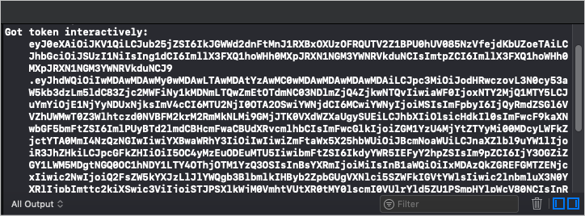

<!-- markdownlint-disable MD002 MD041 -->

<span data-ttu-id="4afa3-101">在本练习中，你将扩展上一练习中的应用程序，以支持 Azure AD 的身份验证。</span><span class="sxs-lookup"><span data-stu-id="4afa3-101">In this exercise you will extend the application from the previous exercise to support authentication with Azure AD.</span></span> <span data-ttu-id="4afa3-102">若要获取所需的 OAuth 访问令牌以调用 Microsoft Graph，这是必需的。</span><span class="sxs-lookup"><span data-stu-id="4afa3-102">This is required to obtain the necessary OAuth access token to call the Microsoft Graph.</span></span> <span data-ttu-id="4afa3-103">为此，需要将[iOS 的 Microsoft 身份验证库（MSAL）](https://github.com/AzureAD/microsoft-authentication-library-for-objc)集成到应用程序中。</span><span class="sxs-lookup"><span data-stu-id="4afa3-103">To do this, you will integrate the [Microsoft Authentication Library (MSAL) for iOS](https://github.com/AzureAD/microsoft-authentication-library-for-objc) into the application.</span></span>

1. <span data-ttu-id="4afa3-104">在名为**AuthSettings**的**GraphTutorial**项目中创建一个新的**属性列表**文件。</span><span class="sxs-lookup"><span data-stu-id="4afa3-104">Create a new **Property List** file in the **GraphTutorial** project named **AuthSettings.plist**.</span></span>
1. <span data-ttu-id="4afa3-105">将以下项添加到**根**字典中的文件中。</span><span class="sxs-lookup"><span data-stu-id="4afa3-105">Add the following items to the file in the **Root** dictionary.</span></span>

    | <span data-ttu-id="4afa3-106">键</span><span class="sxs-lookup"><span data-stu-id="4afa3-106">Key</span></span> | <span data-ttu-id="4afa3-107">类型</span><span class="sxs-lookup"><span data-stu-id="4afa3-107">Type</span></span> | <span data-ttu-id="4afa3-108">值</span><span class="sxs-lookup"><span data-stu-id="4afa3-108">Value</span></span> |
    |-----|------|-------|
    | `AppId` | <span data-ttu-id="4afa3-109">String</span><span class="sxs-lookup"><span data-stu-id="4afa3-109">String</span></span> | <span data-ttu-id="4afa3-110">Azure 门户中的应用程序 ID</span><span class="sxs-lookup"><span data-stu-id="4afa3-110">The application ID from the Azure portal</span></span> |
    | `GraphScopes` | <span data-ttu-id="4afa3-111">数组</span><span class="sxs-lookup"><span data-stu-id="4afa3-111">Array</span></span> | <span data-ttu-id="4afa3-112">两个字符串值`User.Read` ：和`Calendars.Read`</span><span class="sxs-lookup"><span data-stu-id="4afa3-112">Two String values: `User.Read` and `Calendars.Read`</span></span> |

    

> [!IMPORTANT]
> <span data-ttu-id="4afa3-114">如果您使用的是源代码管理（如 git），现在是从源代码控制中排除**AuthSettings**文件以避免无意中泄漏您的应用程序 ID 的最佳时机。</span><span class="sxs-lookup"><span data-stu-id="4afa3-114">If you're using source control such as git, now would be a good time to exclude the **AuthSettings.plist** file from source control to avoid inadvertently leaking your app ID.</span></span>

## <a name="implement-sign-in"></a><span data-ttu-id="4afa3-115">实施登录</span><span class="sxs-lookup"><span data-stu-id="4afa3-115">Implement sign-in</span></span>

<span data-ttu-id="4afa3-116">在本节中，您将为 MSAL 配置项目，创建身份验证管理器类，并更新应用程序以进行登录和注销。</span><span class="sxs-lookup"><span data-stu-id="4afa3-116">In this section you will configure the project for MSAL, create an authentication manager class, and update the app to sign in and sign out.</span></span>

### <a name="configure-project-for-msal"></a><span data-ttu-id="4afa3-117">为 MSAL 配置项目</span><span class="sxs-lookup"><span data-stu-id="4afa3-117">Configure project for MSAL</span></span>

1. <span data-ttu-id="4afa3-118">将新的密钥链组添加到项目的功能中。</span><span class="sxs-lookup"><span data-stu-id="4afa3-118">Add a new keychain group to your project's capabilities.</span></span>
    1. <span data-ttu-id="4afa3-119">依次选择 " **GraphTutorial** " 项目、"**签名 & 功能**"。</span><span class="sxs-lookup"><span data-stu-id="4afa3-119">Select the **GraphTutorial** project, then **Signing & Capabilities**.</span></span>
    1. <span data-ttu-id="4afa3-120">选择 " **+ 功能**"，然后双击 "**密钥链共享**"。</span><span class="sxs-lookup"><span data-stu-id="4afa3-120">Select **+ Capability**, then double-click **Keychain Sharing**.</span></span>
    1. <span data-ttu-id="4afa3-121">添加具有值`com.microsoft.adalcache`的密钥链组。</span><span class="sxs-lookup"><span data-stu-id="4afa3-121">Add a keychain group with the value `com.microsoft.adalcache`.</span></span>

1. <span data-ttu-id="4afa3-122">控件单击 " **plist** "，然后选择 "**打开方式**"，然后选择 "**源代码**"。</span><span class="sxs-lookup"><span data-stu-id="4afa3-122">Control click **Info.plist** and select **Open As**, then **Source Code**.</span></span>
1. <span data-ttu-id="4afa3-123">在`<dict>`元素内添加以下项。</span><span class="sxs-lookup"><span data-stu-id="4afa3-123">Add the following inside the `<dict>` element.</span></span>

    ```xml
    <key>CFBundleURLTypes</key>
    <array>
      <dict>
        <key>CFBundleURLSchemes</key>
        <array>
          <string>msauth.$(PRODUCT_BUNDLE_IDENTIFIER)</string>
        </array>
      </dict>
    </array>
    <key>LSApplicationQueriesSchemes</key>
    <array>
        <string>msauthv2</string>
        <string>msauthv3</string>
    </array>
    ```

1. <span data-ttu-id="4afa3-124">打开**AppDelegate** ，并在文件顶部添加以下导入语句。</span><span class="sxs-lookup"><span data-stu-id="4afa3-124">Open **AppDelegate.m** and add the following import statement at the top of the file.</span></span>

    ```objc
    #import <MSAL/MSAL.h>
    ```

1. <span data-ttu-id="4afa3-125">将以下函数添加到 `AppDelegate` 类。</span><span class="sxs-lookup"><span data-stu-id="4afa3-125">Add the following function to the `AppDelegate` class.</span></span>

    :::code language="objc" source="../demo/GraphTutorial/GraphTutorial/AppDelegate.m" id="HandleMsalResponseSnippet":::

### <a name="create-authentication-manager"></a><span data-ttu-id="4afa3-126">创建身份验证管理器</span><span class="sxs-lookup"><span data-stu-id="4afa3-126">Create authentication manager</span></span>

1. <span data-ttu-id="4afa3-127">在名为**authenticationmanager.java**的**GraphTutorial**项目中创建一个新的**Cocoa Touch 类**。</span><span class="sxs-lookup"><span data-stu-id="4afa3-127">Create a new **Cocoa Touch Class** in the **GraphTutorial** project named **AuthenticationManager**.</span></span> <span data-ttu-id="4afa3-128">在字段的 "**子类**" 中选择 " **NSObject** "。</span><span class="sxs-lookup"><span data-stu-id="4afa3-128">Choose **NSObject** in the **Subclass of** field.</span></span>
1. <span data-ttu-id="4afa3-129">打开**authenticationmanager.java** ，并将其内容替换为以下代码。</span><span class="sxs-lookup"><span data-stu-id="4afa3-129">Open **AuthenticationManager.h** and replace its contents with the following code.</span></span>

    :::code language="objc" source="../demo/GraphTutorial/GraphTutorial/AuthenticationManager.h" id="AuthManagerSnippet":::

1. <span data-ttu-id="4afa3-130">打开**authenticationmanager.java**并将其内容替换为以下代码。</span><span class="sxs-lookup"><span data-stu-id="4afa3-130">Open **AuthenticationManager.m** and replace its contents with the following code.</span></span>

    :::code language="objc" source="../demo/GraphTutorial/GraphTutorial/AuthenticationManager.m" id="AuthManagerSnippet":::

### <a name="add-sign-in-and-sign-out"></a><span data-ttu-id="4afa3-131">添加登录和注销</span><span class="sxs-lookup"><span data-stu-id="4afa3-131">Add sign-in and sign-out</span></span>

1. <span data-ttu-id="4afa3-132">打开**SignInViewController**文件并将其内容替换为以下代码。</span><span class="sxs-lookup"><span data-stu-id="4afa3-132">Open the **SignInViewController.m** file and replace its contents with the following code.</span></span>

    :::code language="objc" source="../demo/GraphTutorial/GraphTutorial/SignInViewController.m" id="SignInViewSnippet":::

1. <span data-ttu-id="4afa3-133">打开**WelcomeViewController** ，并将以下`import`语句添加到文件顶部。</span><span class="sxs-lookup"><span data-stu-id="4afa3-133">Open **WelcomeViewController.m** and add the following `import` statement to the top of the file.</span></span>

    ```objc
    #import "AuthenticationManager.h"
    ```

1. <span data-ttu-id="4afa3-134">将现有的 `signOut` 函数替换为以下内容。</span><span class="sxs-lookup"><span data-stu-id="4afa3-134">Replace the existing `signOut` function with the following.</span></span>

    :::code language="objc" source="../demo/GraphTutorial/GraphTutorial/WelcomeViewController.m" id="SignOutSnippet":::

1. <span data-ttu-id="4afa3-135">保存所做的更改，并在模拟器中重新启动应用程序。</span><span class="sxs-lookup"><span data-stu-id="4afa3-135">Save your changes and restart the application in Simulator.</span></span>

<span data-ttu-id="4afa3-136">如果登录到应用，您应该会看到在 Xcode 的输出窗口中显示的访问令牌。</span><span class="sxs-lookup"><span data-stu-id="4afa3-136">If you sign in to the app, you should see an access token displayed in the output window in Xcode.</span></span>



## <a name="get-user-details"></a><span data-ttu-id="4afa3-138">获取用户详细信息</span><span class="sxs-lookup"><span data-stu-id="4afa3-138">Get user details</span></span>

<span data-ttu-id="4afa3-139">在本节中，您将创建一个帮助程序类，以保存对 Microsoft Graph 的所有调用并`WelcomeViewController`更新，以使用此新类获取已登录的用户。</span><span class="sxs-lookup"><span data-stu-id="4afa3-139">In this section you will create a helper class to hold all of the calls to Microsoft Graph and update the `WelcomeViewController` to use this new class to get the logged-in user.</span></span>

1. <span data-ttu-id="4afa3-140">在名为**GraphManager**的**GraphTutorial**项目中创建一个新的**Cocoa Touch 类**。</span><span class="sxs-lookup"><span data-stu-id="4afa3-140">Create a new **Cocoa Touch Class** in the **GraphTutorial** project named **GraphManager**.</span></span> <span data-ttu-id="4afa3-141">在字段的 "**子类**" 中选择 " **NSObject** "。</span><span class="sxs-lookup"><span data-stu-id="4afa3-141">Choose **NSObject** in the **Subclass of** field.</span></span>
1. <span data-ttu-id="4afa3-142">打开**GraphManager** ，并将其内容替换为以下代码。</span><span class="sxs-lookup"><span data-stu-id="4afa3-142">Open **GraphManager.h** and replace its contents with the following code.</span></span>

    ```objc
    #import <Foundation/Foundation.h>
    #import <MSGraphClientSDK/MSGraphClientSDK.h>
    #import <MSGraphClientModels/MSGraphClientModels.h>
    #import <MSGraphClientModels/MSCollection.h>
    #import "AuthenticationManager.h"

    NS_ASSUME_NONNULL_BEGIN

    typedef void (^GetMeCompletionBlock)(MSGraphUser* _Nullable user, NSError* _Nullable error);

    @interface GraphManager : NSObject

    + (id) instance;
    - (void) getMeWithCompletionBlock: (GetMeCompletionBlock)completionBlock;

    @end

    NS_ASSUME_NONNULL_END
    ```

1. <span data-ttu-id="4afa3-143">打开**GraphManager**并将其内容替换为以下代码。</span><span class="sxs-lookup"><span data-stu-id="4afa3-143">Open **GraphManager.m** and replace its contents with the following code.</span></span>

    ```objc
    #import "GraphManager.h"

    @interface GraphManager()

    @property MSHTTPClient* graphClient;

    @end

    @implementation GraphManager

    + (id) instance {
        static GraphManager *singleInstance = nil;
        static dispatch_once_t onceToken;
        dispatch_once(&onceToken, ^ {
            singleInstance = [[self alloc] init];
        });

        return singleInstance;
    }

    - (id) init {
        if (self = [super init]) {
            // Create the Graph client
            self.graphClient = [MSClientFactory
                                createHTTPClientWithAuthenticationProvider:AuthenticationManager.instance];
        }

        return self;
    }

    - (void) getMeWithCompletionBlock:(GetMeCompletionBlock)completionBlock {
        // GET /me
        NSString* meUrlString = [NSString stringWithFormat:@"%@/me", MSGraphBaseURL];
        NSURL* meUrl = [[NSURL alloc] initWithString:meUrlString];
        NSMutableURLRequest* meRequest = [[NSMutableURLRequest alloc] initWithURL:meUrl];

        MSURLSessionDataTask* meDataTask =
        [[MSURLSessionDataTask alloc]
            initWithRequest:meRequest
            client:self.graphClient
            completion:^(NSData *data, NSURLResponse *response, NSError *error) {
                if (error) {
                    completionBlock(nil, error);
                    return;
                }

                // Deserialize the response as a user
                NSError* graphError;
                MSGraphUser* user = [[MSGraphUser alloc] initWithData:data error:&graphError];

                if (graphError) {
                    completionBlock(nil, graphError);
                } else {
                    completionBlock(user, nil);
                }
            }];

        // Execute the request
        [meDataTask execute];
    }

    @end
    ```

1. <span data-ttu-id="4afa3-144">打开**WelcomeViewController** ，并在文件顶部添加`#import`以下语句。</span><span class="sxs-lookup"><span data-stu-id="4afa3-144">Open **WelcomeViewController.m** and add the following `#import` statements at the top of the file.</span></span>

    ```objc
    #import "SpinnerViewController.h"
    #import "GraphManager.h"
    #import <MSGraphClientModels/MSGraphClientModels.h>
    ```

1. <span data-ttu-id="4afa3-145">将以下属性添加到`WelcomeViewController`接口声明中。</span><span class="sxs-lookup"><span data-stu-id="4afa3-145">Add the following property to the `WelcomeViewController` interface declaration.</span></span>

    ```objc
    @property SpinnerViewController* spinner;
    ```

1. <span data-ttu-id="4afa3-146">将现有`viewDidLoad`替换为以下代码。</span><span class="sxs-lookup"><span data-stu-id="4afa3-146">Replace the existing `viewDidLoad` with the following code.</span></span>

    :::code language="objc" source="../demo/GraphTutorial/GraphTutorial/WelcomeViewController.m" id="ViewDidLoadSnippet":::

<span data-ttu-id="4afa3-147">如果现在保存更改并重新启动应用程序，则在使用用户的显示名称和电子邮件地址更新 UI 后，登录 UI。</span><span class="sxs-lookup"><span data-stu-id="4afa3-147">If you save your changes and restart the app now, after sign-in the UI is updated with the user's display name and email address.</span></span>
